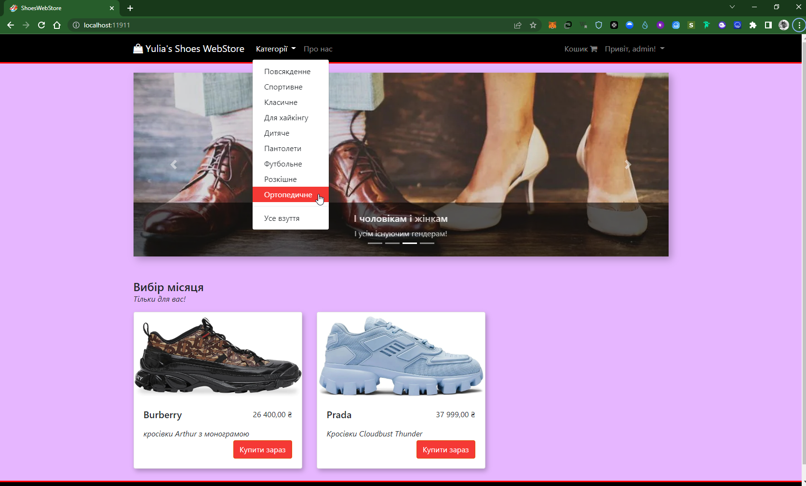
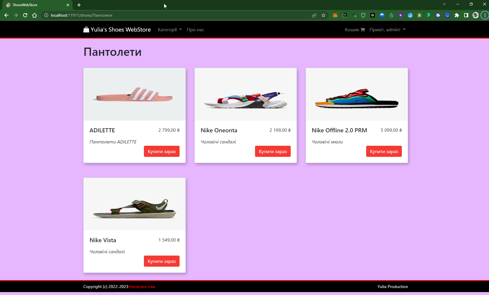
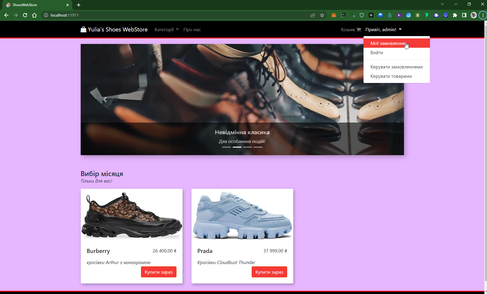
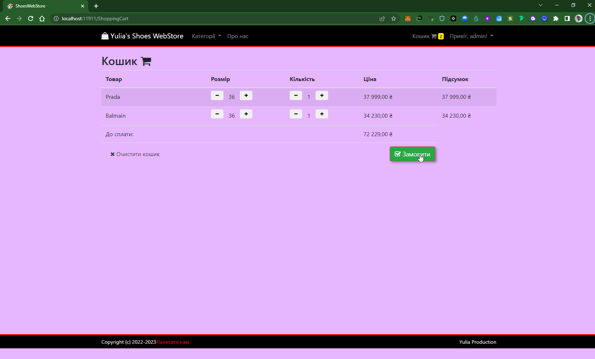
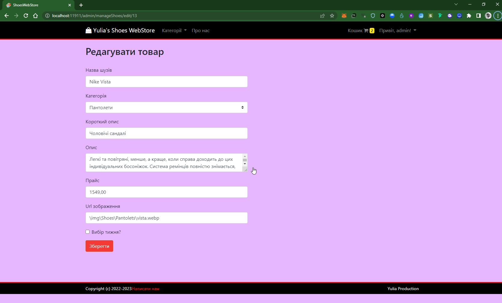

# Shoe Shop

A sample ShoesWebStore built with ASP.NET Core (Multi-Page Application)


## APP/Code Features
- Only Admin can perform Create/Edit/Delete shoes & manage Orders.
- Normal User can only can buy shoes & view their orders.
- Managing Cart System using cookie.
- Client Side & Server side validation,
- Cookie Based Authentication & Authorization - Not Session
- Login through either `Username` or `Email`.
- Responsive UI
- Repository Pattern
- Application Architecture is decoupled form ORM (Entity Framework)

## Framework / Library
- ASP.NET Core 2.0 *(Backend)*
- Razor View Engine *(For generating markup)*
- Entity Framework Core *(ORM)*
- ASP.NET Identity *(Cookie Based Authentication & Authorization - Not Session)*
- AutoMapper *(For mapping into Domain Model & DTO)*
- jQuery & Bootstap 4

## To run the project locally:
   > admin account : `admin@admin.com` and Password: `Passw@rd!123` (You can change it from `appsettings.json` before apply `update database`)

   > Make sure, dotnet core SDK & npm is installed in your machine.

- **Using VS2022**
     ```
       > git clone https://github.com/AskoldNebelskyi/ShoesWebStore
       > cd ShoesWebStore/
    ```
    - Now Open the `ShoesWebStore.sln` through `VS2022`.
    - Open `appsettings.json` & change the connection string. (It as this the default connection string of `SQL Server Express` that comes with `Visual Studio`).
    - Hit `Ctrl+Shift+B` to build.
    - Open project directory in terminal and run `npm install`
    - Open `Package Manager Console` from `Tools` and enter `Update-Database`.
    - Hit `Ctrl+F5` to run without debugging.

- **Using CLI**
    ```
        > git clone https://github.com/AskoldNebelskyi/ShoesWebStore
        > cd ShoesWebStore/ShoesWebStore
        > npm install
        > dotnet restore
        > set ASPNETCORE_ENVIRONMENT=Development
        > set ConnectionStrings:DefaultConnection="<YOUR CONNECTION STRING>"
        > npm i webpack -g
        > webpack --config webpack.config.js
        > npm run build
        > dotnet build
        > dotnet ef database update
        > dotnet run
    ```

## Sceenshots





