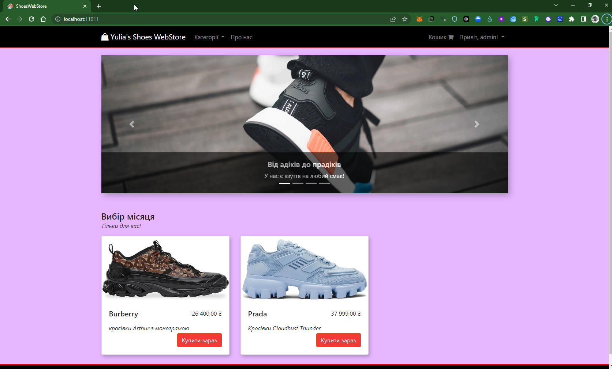

# Shoe Shop

A sample ShoesWebStore built with ASP.NET Core (Multi-Page Application)



## APP/Code Features
- Лише адміністратор може створювати/редагувати/видаляти взуття та керувати замовленнями.
- Звичайний користувач може лише купувати взуття та переглядати свої замовлення.
- Управління системою кошиків за допомогою файлів cookie.
- Перевірка на стороні клієнта та на стороні сервера,
- Автентифікація та авторизація на основі файлів cookie - не сеанс
- Увійдіть за допомогою `Ім'я користувача` або `Електронна пошта`.
- Чуйний інтерфейс користувача
- Шаблон сховища
- Архітектура програми відокремлена від ORM (Entity Framework)

## Framework / Library
- ASP.NET Core 2.0 *(Backend)*
- Механізм перегляду Razor *(Для створення розмітки)*
- Entity Framework Core *(ORM)*
- Ідентифікація ASP.NET *(автентифікація та авторизація на основі файлів cookie - не сеанс)*
- AutoMapper *(Для відображення в моделі домену та DTO)*
- jQuery & Bootstap 4

## Щоб запустити проект локально:
    > обліковий запис адміністратора: `admin@admin.com` і пароль: `Passw@rd!123` (Ви можете змінити його в `appsettings.json` перед застосуванням `оновлення бази даних`)

    > Переконайтеся, що на вашій машині встановлено дотнет-ядро SDK і npm.

- **Використовуючи VS2022**
     ```
       > git clone https://github.com/AskoldNebelskyi/ShoesWebStore
       > cd ShoesWebStore/
    ```
    - Тепер відкрийте `ShoesWebStore.sln` через `VS2022`.
     - Відкрийте `appsettings.json` і змініть рядок підключення. (Це стандартний рядок підключення `SQL Server Express`, який постачається з `Visual Studio`).
     - Натисніть `Ctrl+Shift+B`, щоб створити.
     - Відкрийте каталог проекту в терміналі та запустіть `npm install`
     - Відкрийте `Package Manager Console` з `Tools` і введіть `Update-Database`.
     - Натисніть `Ctrl+F5`, щоб запустити без налагодження.

- **Використовуючи CLI**
    ```
        > git clone https://github.com/AskoldNebelskyi/ShoesWebStore
        > cd ShoesWebStore/ShoesWebStore
        > npm install
        > dotnet restore
        > set ASPNETCORE_ENVIRONMENT=Development
        > set ConnectionStrings:DefaultConnection="<YOUR CONNECTION STRING>"
        > npm i webpack -g
        > webpack --config webpack.config.js
        > npm run build
        > dotnet build
        > dotnet ef database update
        > dotnet run
    ```

## Sceenshots


